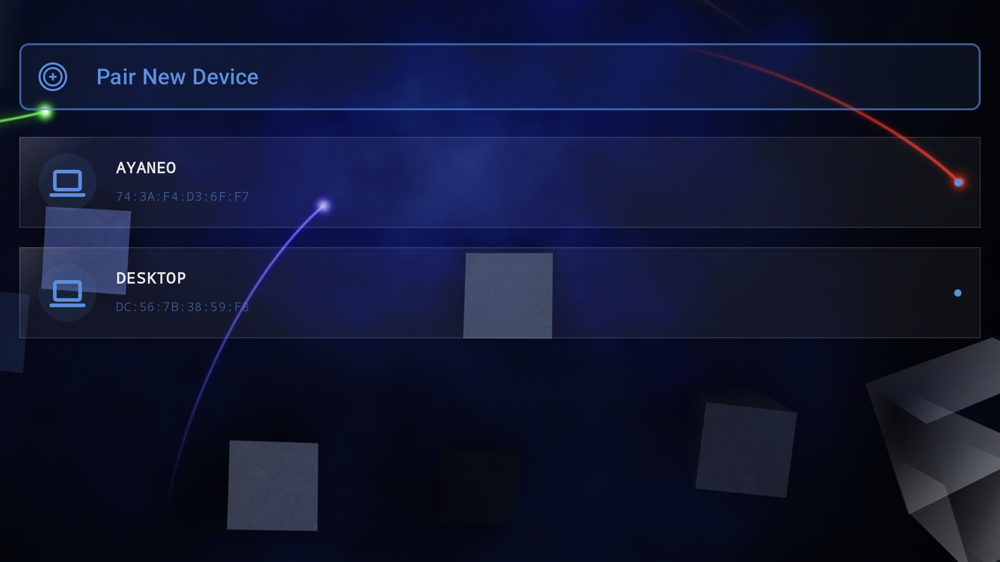
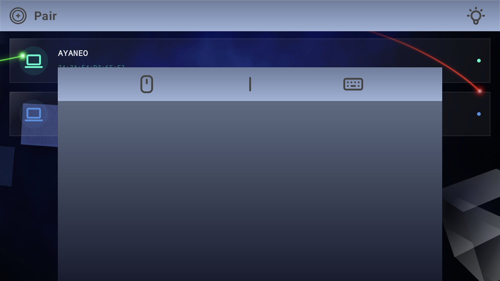
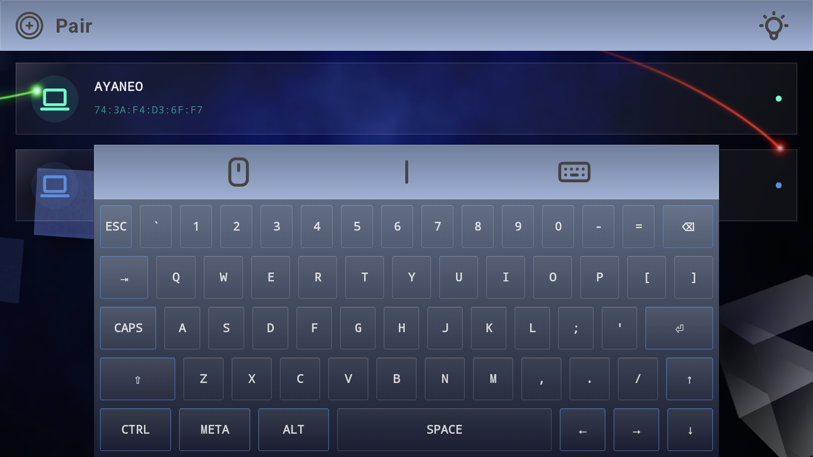

# BlueMoon

  

  <b>Turn your retro handheld into the ultimate Bluetooth peripheral.</b>

  
  
  

---

## 📱 What is BlueMoon?

**BlueMoon** is a Kotlin Multiplatform (KMP) application that transforms your Android-based retro handheld into a fully functional **Bluetooth HID peripheral**.

Unlike other solutions, BlueMoon requires **zero server-side software**.

Your device will be recognized as a native hardware controller, keyboard, or mouse by the host system. Whether you're playing games on your PC, navigating a media center, or controlling a tablet, BlueMoon bridges the gap between your handheld's physical buttons and your other devices.

### Key Features

* **Game Controller:** Full gamepad mapping for retro titles or modern gaming.
* **Touchpad Mode:** Use your handheld's screen as touchpad for your PC/Mac.
* **Remote Keyboard:** Type long URLs or searches on your host device using your handheld.
* **Media Control:** Dedicated volume and playback controls for a seamless "couch-to-TV" experience.
* **Bluetooth Classic:** High compatibility with low latency (250Hz).

---

## 🖼️ Screenshots

| Home                                   | Touchpad                        | Keyboard                        |
|----------------------------------------|---------------------------------|---------------------------------|
|  |  |  |

---

## 💻 Compatibility

| Host Platform | Compatibility | Note                                                                               |
|---------------|---------------|------------------------------------------------------------------------------------|
| **Windows**   | ✅             | Native HID Support                                                                 |
| **macOS**     | ✅             | Native HID Support                                                                 |
| **Linux**     | ✅             | Works via BlueZ                                                                    |
| **Android**   | ✅             | Works as generic input                                                             |
| **Apple TV**  | ⚠️            | Limited due to Apple's because I can't spoof Official controllers and it's not MFi |

---

## 🚀 Installation & Setup

1. **Download:** Grab the latest `.apk` from the [Releases](https://www.google.com/search?q=https://github.com/yourusername/BlueMoon/releases) section.
* *Pro-tip:* You can use **[Obtainium](https://www.google.com/search?q=https://github.com/ImranRQD/Obtainium)** to track and install updates directly from this repository.
2. **Sideload:** Install the APK on your Android-powered handheld (Retroid, Anbernic, AYN, etc.).
3. **Pair:** * Open BlueMoon.
4. **Go:** Once paired, swipe one of your paired hosts and your handheld will immediately act as the selected input type.

---

## 🛠️ Built With

* **[Kotlin Multiplatform](https://kotlinlang.org/docs/multiplatform.html):** Shared logic across platforms.
* **Jetpack Compose:** For a modern, responsive UI.
* **Bluetooth Classic HID:** Native driver-less communication.

---

## 🤝 Contributing

I am actively looking for contributors to help expand BlueMoon’s capabilities! Whether it's adding new HID profiles, optimizing latency, or improving the UI, your help is welcome.

1. Fork the Project.
2. Create your Feature Branch (`git checkout -b feature/AmazingFeature`).
3. Commit your Changes (`git commit -m 'Add some AmazingFeature'`).
4. Push to the Branch (`git push origin feature/AmazingFeature`).
5. Open a Pull Request.
